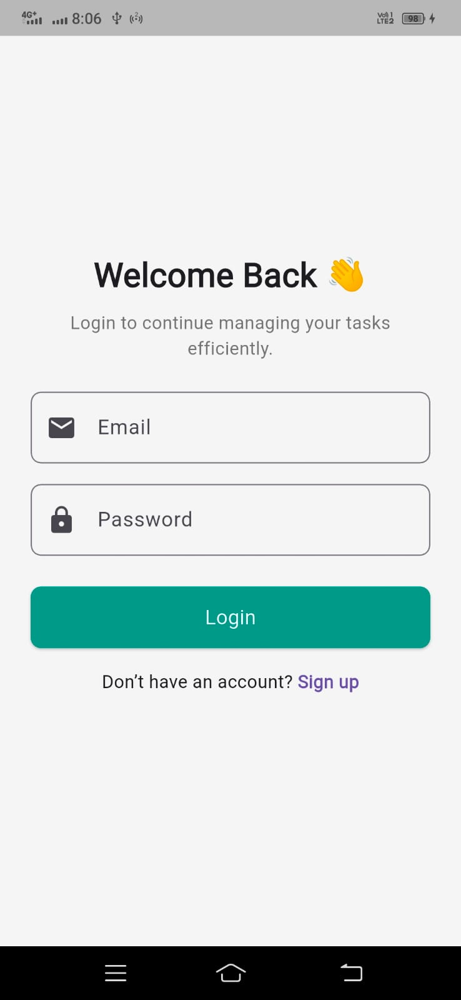
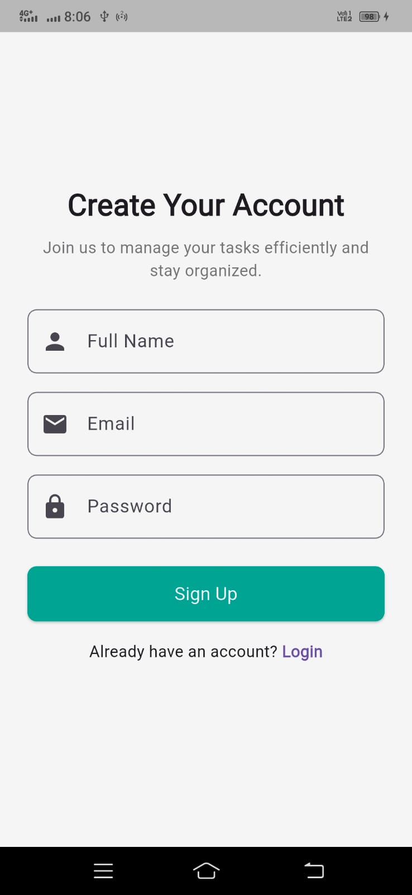
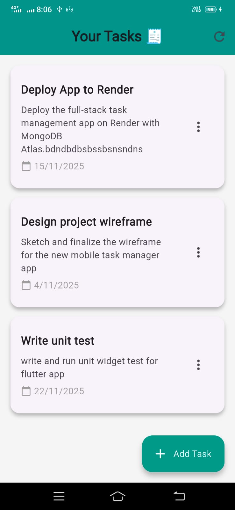
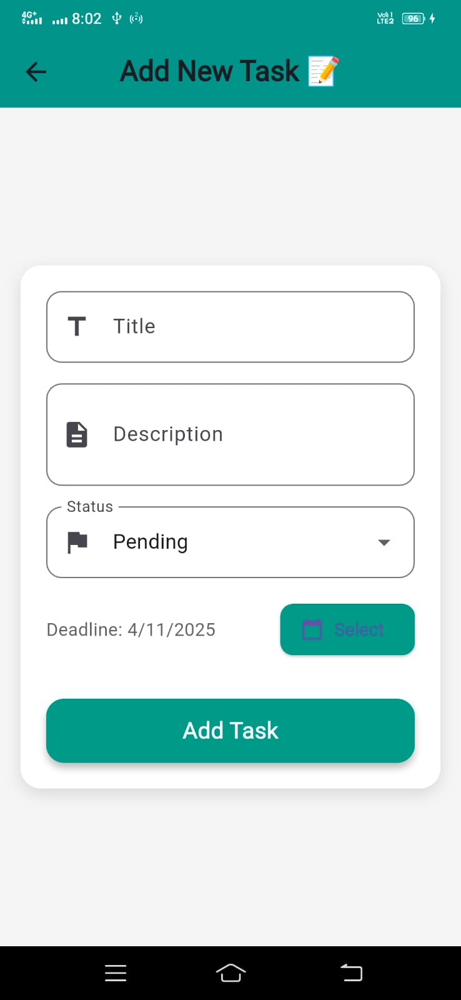
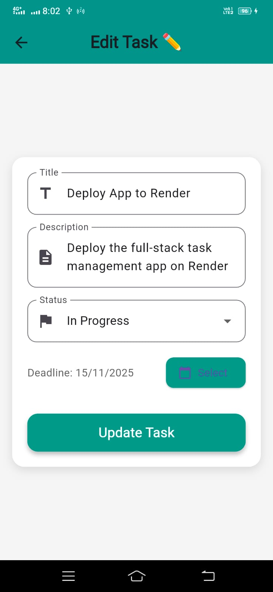
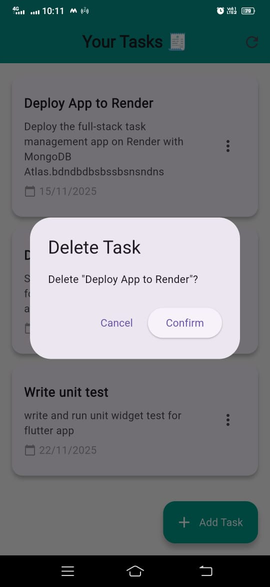

## Task Management 

A **task management application** built with **Flutter** and a **REST API **, allowing users to **signup, log in, and manage (create, update, delete, filter)** tasks seamlessly.  
Features a **simple, clean UI**, secure authentication, and token-based API calls.

---

## Features

- 🔐 **Authentication** — User signup and login with token-based authentication  
- 🗂️ **Task CRUD** — Create, edit, delete, and view tasks  
- 📱 **Responsive UI** — Flutter mobile app with a modern, smooth interface  
- 🔒 **Secure API** — Backend uses `Authorization: Bearer <token>` for all task operations  

---

### 🖼️ Screens

| Login | Sign Up | All Tasks | 
|--------|---------|
|  |  | |

| Add Task | Edit Task | Delete task
|------------|-----------|------------|
|  |  | |

---


### 🧩 Prerequisites

- [Flutter SDK](https://flutter.dev/docs/get-started/install) (stable channel)
- Dart (bundled with Flutter)
- Android Studio / Xcode / VS Code (for emulator/simulator)
- A backend API endpoint ready to connect (you already have your backend URL)

---

###  Installation & Setup

1. **Clone the repository**
   ```bash
   git clone https://github.com/yourusername/flutter-task-manager.git
   cd mobile
   ```

2. **Install dependencies**
   ```bash
   flutter pub get
   ```   
3. **Run the app**
   ```bash
   flutter run
   ```   

###  📦 Dependencies   
 ```bash
    dependencies:
        flutter:
            sdk: flutter
        http: ^1.5.0
        cupertino_icons: ^1.0.8
        shared_preferences: ^2.3.2
   ```   
